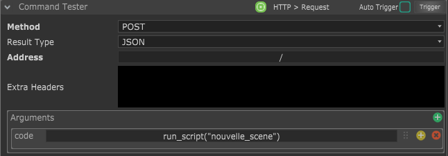

# Smode Server HTTP

*[Version française](README.fr.md)*

A small **HTTP/JSON server that runs inside a Smode Script**, so that anything that can send an HTTP request
(Chataigne, a Stream Deck, a web page on your network, `curl`...) can trigger Smode Scripts and, if needed, run
code in Smode.

It is derived from the generic bridge of [smode-mcp](https://github.com/gyomh/smode-mcp), but with a different
purpose: **smode-mcp** lets Claude drive Smode, **Smode Server HTTP** gives your control surfaces a structured API.

> **Experimental, not an official Smode tool.** Built by trial and error against the Oil API
> (see [smode-oil-reference](https://github.com/gyomh/smode-oil-reference)). Use it on a network you trust.

## Install

1. Drag `smode_server_http.py` into your Smode project.
2. Set its **Launch Mode** to **At Every Update** (the server hands the work to Smode's main thread through a
   queue, which is only processed while the Script updates).
3. Choose a **Port** (default `8892`) and, only if other machines must reach it, fill **Host** with the IP(s) of
   your machine, separated by commas. Empty means **localhost only**.
4. Drag the Scripts you want to trigger into **slot1 to slot8**. They are switched to Manual launch mode.

Change the port or the hosts, then tick **restartServer** (it unticks itself) to apply without restarting Smode.

## Endpoints

| Endpoint | Who can call it | What it does |
|---|---|---|
| `GET /status` (or `/slots`) | LAN | Port and the list of the 8 slots |
| `GET /run/<n>` or `/run/<script name>` | LAN | Triggers the Script in slot `n`, or the slot whose Script has that name |
| `POST /exec` with `code=...` | This machine only (or valid token) | Runs Python code in Smode (set a variable `result` to get a value back) |
| `GET /eval?expr=...` | This machine only (or valid token) | Evaluates a Python expression in Smode |

Parameters are accepted as a query string, a JSON body or a form-urlencoded body (Chataigne's default). Answers are
JSON: `{"success": true, "result": ..., "output": "...", "error": null}`.

Examples:

```
curl http://127.0.0.1:8892/status
curl http://127.0.0.1:8892/run/1
curl -X POST http://127.0.0.1:8892/exec --data-urlencode "code=result = len(script.project.masterScene.layers)"
```

## Triggering Scripts from Chataigne (Stream Deck, any HTTP client)


*The screenshots below come from the [smode-mcp](https://github.com/gyomh/smode-mcp) bridge, which looks the same
in Chataigne and in Smode: with Smode Server HTTP the default port is `8892` instead of `8891`, and it also has
**Host** and **Token** parameters.*

In Chataigne, add an **HTTP** module and set its **Base Address** to `http://127.0.0.1:8892` (or the IP you gave in
**Host**, from another machine), then add a consequence that sends a request:


- **Simplest:** method `GET`, address `/run/1` (slot 1) or `/run/my_script` (by name).
- **As in the screenshots:** method `POST`, address `/`, argument `code` with `run_slot(1)` or
  `run_script("my_script")`. This is the same format as the smode-mcp bridge, so Chataigne projects can be reused;
  it needs to come from the machine running Smode (or carry the **Token**), because it goes through `/exec`.



Then map the consequence to a Stream Deck button in Chataigne.

## Security

`/exec` and `/eval` run arbitrary code inside Smode, so they are locked down:

- The server never listens on `0.0.0.0`: only on `127.0.0.1` plus the IPs you list in **Host**.
- `/exec` and `/eval` are accepted **only from the machine itself**, or from the network with a valid **Token**
  (header `X-Token: xxx` or `?token=xxx`).
- **Requests coming from a web page are refused** (any request carrying an `Origin` header, since browsers add it
  on cross-site requests, even toward `127.0.0.1`), and so are requests whose `Host` is not one of your addresses
  (DNS rebinding). Without that, any website you visit could ask your Smode to run code.
- CORS is open only for `/status` and `/run`.
- `/run` and `/status` are open to the network on purpose: only put harmless Scripts in the slots.

## Credit

Based on the queue + main thread pattern of `smode_bridge.py` from [smode-mcp](https://github.com/gyomh/smode-mcp).

## License

MIT — see [LICENSE](LICENSE).
